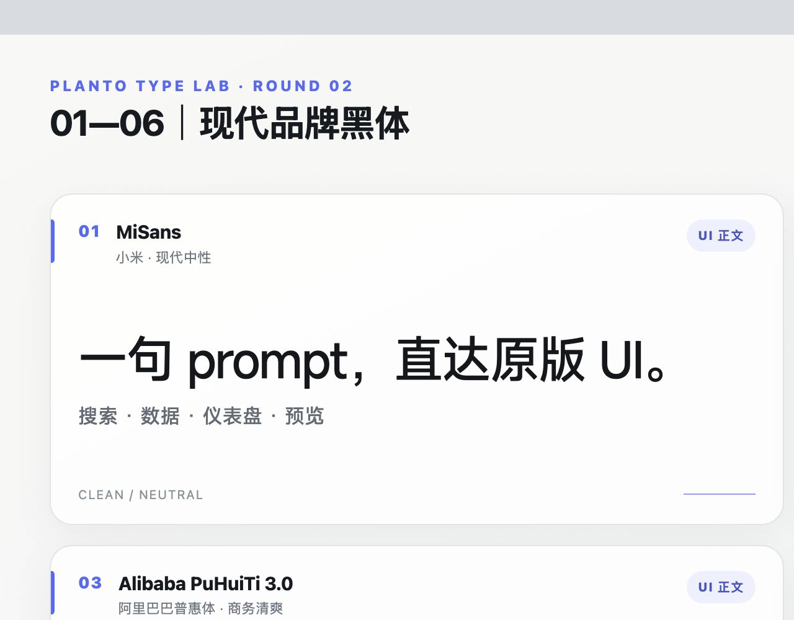
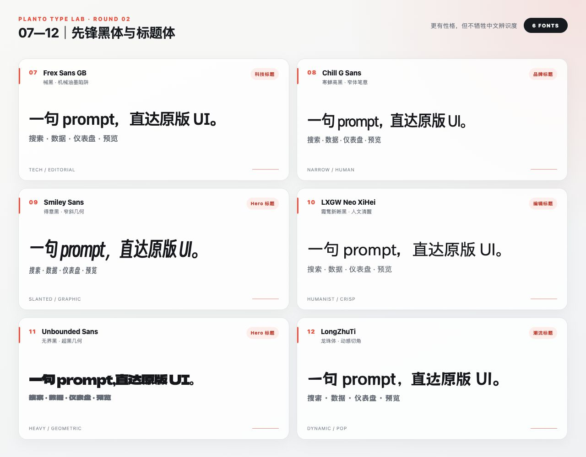
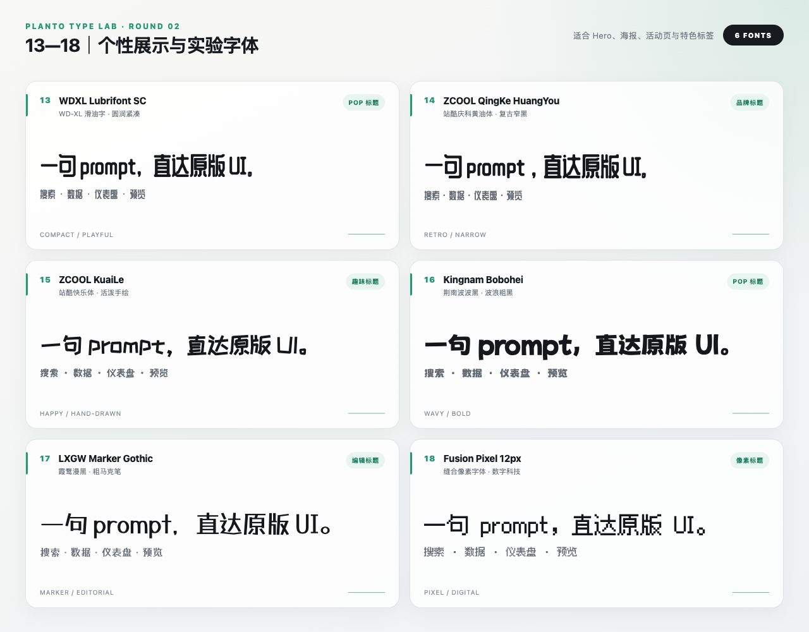
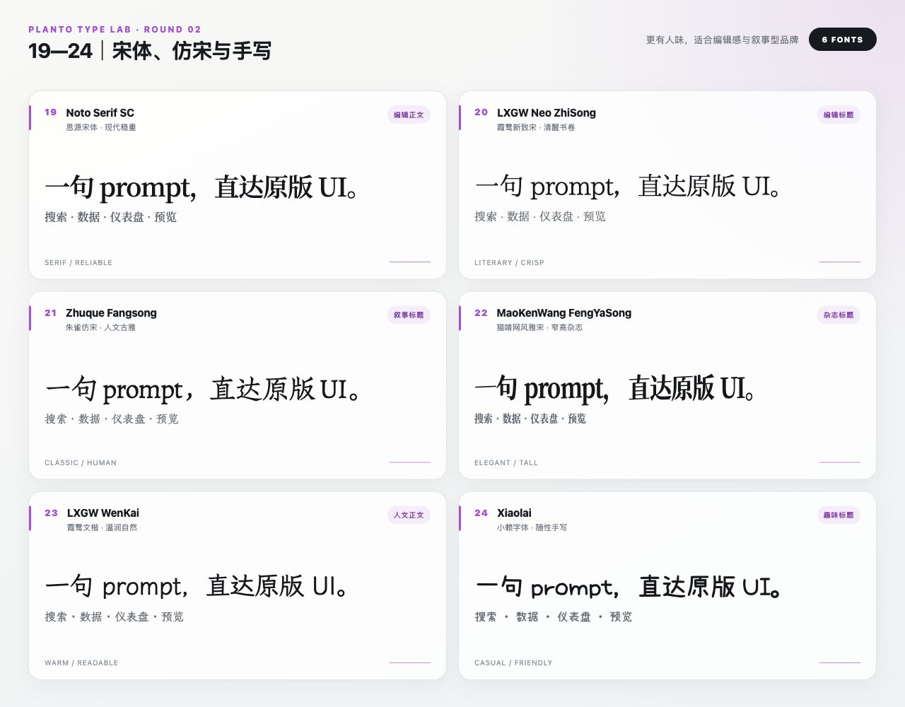

# 女娲 · Chinese Character Open

一个可直接安装为 Codex 插件的中文字体库：**24 款编号候选、20 款原始开放字体、4 款官方链接、逐字体许可证、可重复校验的 SHA-256**。

> 代码与原创文档使用 MIT；字体文件不共用一张许可证，分别遵循各自上游条款。`01`、`02`、`03`、`06` 不在仓库中分发字体二进制。

## 24 款视觉预览









## 安装为 Codex 插件

```bash
codex plugin marketplace add reymondmeking-dot/nvwa-Chinese-character-open
codex plugin add chinese-character-open@nvwa-chinese-character-open
```

安装后，可以直接说：

```text
$chinese-character-open 给当前网站挑三款大胆的中文标题字体并生成同文案预览
$chinese-character-open 列出 24 款字体，告诉我哪些适合科技感产品
$chinese-character-open 把 17 号字体安全导出到当前网页项目
```

## 命令行使用

```bash
python3 plugins/chinese-character-open/skills/chinese-character-open/scripts/fontkit.py list
python3 plugins/chinese-character-open/skills/chinese-character-open/scripts/fontkit.py info 17

python3 plugins/chinese-character-open/skills/chinese-character-open/scripts/fontkit.py preview \
  --font 14,17,18 \
  --text "让中文标题更有个性。" \
  --output /absolute/path/font-preview.html

python3 plugins/chinese-character-open/skills/chinese-character-open/scripts/fontkit.py export \
  --font 17 \
  --output-dir /absolute/project/path/public/fonts/chinese-character-open
```

`preview` 和 `export` 会先校验文件大小与 SHA-256，再复制字体、生成 CSS，并带上完整许可证。四款 `link-only` 字体会返回官方来源，不会绕过授权下载。

## 字体目录

| ID | 字体 | 风格 | 分发状态 |
|---:|---|---|---|
| 01 | MiSans | 现代、克制、系统级无衬线 | 🔗 官方链接 |
| 02 | HarmonyOS Sans SC | 开放、清晰、屏幕友好 | 🔗 官方链接 |
| 03 | Alibaba PuHuiTi 3.0 | 商业感、均衡、现代 | 🔗 官方链接 |
| 04 | Douyin Sans / 抖音美好体 | 粗壮、圆润 | ✅ 内置 · OFL-1.1 |
| 05 | WenYuan Rounded SC / 文渊圆体 | 温和、几何圆体 | ✅ 内置 · OFL-1.1 |
| 06 | Alimama FangYuanTi VF | 方圆几何、品牌展示 | 🔗 官方链接 |
| 07 | Frex Sans GB / 械黑 GB | 机械、窄长、油墨陷阱 | ✅ 内置 · OFL-1.1 |
| 08 | Chill G Sans / 寒蝉高黑 | 高挑、锐利 | ✅ 内置 · OFL-1.1 |
| 09 | Smiley Sans / 得意黑 | 窄斜、活泼 | ✅ 内置 · OFL-1.1 |
| 10 | LXGW Neo XiHei / 霞鹜新晰黑 | 清晰、人文黑体 | ✅ 原件内置 · IPA-1.0 |
| 11 | Unbounded Sans / 无界黑 | 超黑、几何、强势 | ✅ 内置 · OFL-1.1 |
| 12 | LongZhuTi / 龙珠体 | 动感切角、日系潮流 | ✅ 内置 · OFL-1.1 |
| 13 | WDXL Lubrifont SC / 滑油字 | 紧凑、圆润、POP | ✅ 内置 · OFL-1.1 |
| 14 | ZCOOL QingKe HuangYou / 站酷庆科黄油体 | 紧凑、复古、几何 | ✅ 内置 · OFL-1.1 |
| 15 | ZCOOL KuaiLe / 站酷快乐体 | 俏皮、跳跃、手绘 | ✅ 内置 · OFL-1.1 |
| 16 | Kingnam Bobohei / 荆南波波黑 | 粗重、波浪、动感 | ✅ 内置 · OFL-1.1 |
| 17 | LXGW Marker Gothic / 霞鹜漫黑 | 马克笔、漫画、广告感 | ✅ 内置 · OFL-1.1 |
| 18 | Fusion Pixel 12px / 缝合像素字体 | 像素、复古科技 | ✅ 内置 · OFL-1.1 + notices |
| 19 | Noto Serif SC / 思源宋体 | 稳重、精细、现代宋体 | ✅ 内置 · OFL-1.1 |
| 20 | LXGW Neo ZhiSong / 霞鹜新致宋 | 清瘦、文艺、现代宋体 | ✅ 原件内置 · IPA-1.0 |
| 21 | Zhuque Fangsong / 朱雀仿宋 | 优雅、古典、书卷气 | ✅ 内置 · OFL-1.1 |
| 22 | MaoKenWang FengYaSong / 猫啃网风雅宋 | 窄高、杂志感 | ✅ 内置 · OFL-1.1 |
| 23 | LXGW WenKai / 霞鹜文楷 | 自然、温润、可读 | ✅ 内置 · OFL-1.1 |
| 24 | Xiaolai / 小赖字体 | 随性、亲切、日常手写 | ✅ 内置 · OFL-1.1 |

完整许可证、来源和分发说明见 [FONT_LICENSES.md](plugins/chinese-character-open/FONT_LICENSES.md)。机器可读数据见 [catalog/fonts.json](plugins/chinese-character-open/catalog/fonts.json)。

## 为什么有四款只给链接

- MiSans 禁止将字体或副本作为独立字体资源进一步分发。
- HarmonyOS Sans 可随非字体软件捆绑，但这个仓库本身是字体集合。
- 阿里巴巴普惠体与阿里妈妈方圆体允许特定范围内免费或商业使用，但没有明确授权公共字体仓库独立再分发。

预览图是用字体制作的视觉作品，不包含可提取的字体文件。这样的处理既保留 24 款选择，也不把“免费商用”误写成“开源可再分发”。

## 仓库结构

```text
.agents/plugins/marketplace.json          Codex marketplace
plugins/chinese-character-open/           可安装插件
  .codex-plugin/plugin.json
  catalog/fonts.json                      24 款唯一数据源
  fonts/                                  20 款原始文件 + 4 款链接说明
  skills/chinese-character-open/          查询、预览、导出工具
docs/                                     编号预览页与截图
scripts/validate_catalog.py               授权、哈希与目录校验
```

## 验证

```bash
python3 -m pip install 'fonttools[woff]'
python3 scripts/validate_catalog.py
python3 plugins/chinese-character-open/skills/chinese-character-open/scripts/fontkit.py list --json
```

CI 会拒绝：未登记字体文件、缺少许可证、`link-only` 目录出现字体二进制、哈希不匹配、编号不是 `01`—`24`，或无法被 FontTools 打开。

## 贡献

欢迎补充新的开放中文字体、修正来源或改善预览。提交字体前请先阅读 [CONTRIBUTING.md](CONTRIBUTING.md)，并提供明确的再分发许可证据。不要只写“免费商用”。
